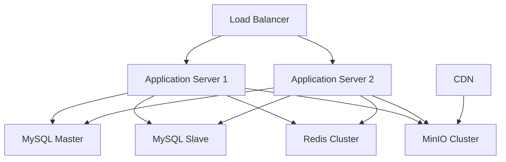

# 部署指南

## 概述

本文档详细介绍了 DreamZero Blog Backend 项目的部署方案，包括开发环境、测试环境和生产环境的部署流程。

## 环境要求

### 最低系统要求
- **操作系统**: Linux (Ubuntu 20.04+ 推荐) / macOS / Windows
- **CPU**: 2核心
- **内存**: 4GB RAM
- **存储**: 20GB 可用空间
- **网络**: 稳定的互联网连接

### 软件依赖
- **Go**: 1.21 或更高版本
- **Git**: 2.0 或更高版本
- **Docker**: 20.0 或更高版本 (可选)
- **Docker Compose**: 1.29 或更高版本 (可选)

### 数据库要求
- **MySQL**: 8.0 或更高版本
- **Redis**: 6.0 或更高版本
- **MinIO**: 最新版本 (对象存储)

## 部署架构



## 环境配置

### 开发环境部署

#### 1. 源码部署

```bash
# 1. 克隆项目
git clone <repository-url>
cd blog-project/backend

# 2. 安装 Go 依赖
go mod download

# 3. 安装开发工具
make install-hooks
make install-tools

# 4. 配置环境变量
cp config/app.yaml.example config/app.yaml
cp config/database.yaml.example config/database.yaml
cp config/redis.yaml.example config/redis.yaml

# 5. 编辑配置文件
vim config/app.yaml
vim config/database.yaml
vim config/redis.yaml

# 6. 初始化数据库
make migrate

# 7. 启动服务
make run
```

#### 2. Docker 部署 (开发)

```bash
# 1. 使用 Docker Compose 启动开发环境
docker-compose -f docker-compose.dev.yml up -d

# 2. 等待服务启动
docker-compose -f docker-compose.dev.yml ps

# 3. 查看日志
docker-compose -f docker-compose.dev.yml logs -f app
```

### 测试环境部署

#### 1. 准备部署脚本

```bash
#!/bin/bash
# deploy-test.sh

set -e

echo "Starting test environment deployment..."

# 1. 拉取最新代码
git pull origin main

# 2. 构建应用
make build

# 3. 停止旧服务
docker-compose -f docker-compose.test.yml down

# 4. 启动新服务
docker-compose -f docker-compose.test.yml up -d

# 5. 等待服务启动
sleep 30

# 6. 健康检查
curl -f http://localhost:8080/health || exit 1

echo "Test environment deployed successfully!"
```

#### 2. 自动化部署 (CI/CD)

**GitHub Actions 示例**:

```yaml
name: Deploy to Test Environment

on:
  push:
    branches: [ main ]

jobs:
  deploy:
    runs-on: ubuntu-latest

    steps:
    - uses: actions/checkout@v3

    - name: Set up Go
      uses: actions/setup-go@v3
      with:
        go-version: 1.21

    - name: Install dependencies
      run: go mod download

    - name: Run tests
      run: make test

    - name: Build application
      run: make build

    - name: Deploy to test server
      uses: appleboy/ssh-action@v0.1.5
      with:
        host: ${{ secrets.TEST_HOST }}
        username: ${{ secrets.TEST_USER }}
        key: ${{ secrets.TEST_SSH_KEY }}
        script: |
          cd /opt/blog-project
          git pull origin main
          make build
          docker-compose -f docker-compose.test.yml up -d
```

### 生产环境部署

#### 1. 服务器准备

```bash
# 1. 创建应用目录
sudo mkdir -p /opt/blog-project
sudo chown $USER:$USER /opt/blog-project
cd /opt/blog-project

# 2. 克隆项目
git clone <repository-url> .
git checkout main

# 3. 安装 Docker 和 Docker Compose
curl -fsSL https://get.docker.com -o get-docker.sh
sh get-docker.sh

# 4. 安装 Docker Compose
sudo curl -L "https://github.com/docker/compose/releases/download/v2.20.0/docker-compose-$(uname -s)-$(uname -m)" -o /usr/local/bin/docker-compose
sudo chmod +x /usr/local/bin/docker-compose
```

#### 2. 生产环境配置

**docker-compose.prod.yml**:
```yaml
version: '3.8'

services:
  app:
    build:
      context: .
      dockerfile: docker/Dockerfile.prod
    ports:
      - "8080:8080"
    environment:
      - GIN_MODE=release
      - APP_ENV=production
    depends_on:
      - db
      - redis
      - minio
    volumes:
      - ./uploads:/app/uploads
      - ./logs:/app/logs
    restart: unless-stopped
    healthcheck:
      test: ["CMD", "curl", "-f", "http://localhost:8080/health"]
      interval: 30s
      timeout: 10s
      retries: 3

  db:
    image: mysql:8.0
    environment:
      MYSQL_ROOT_PASSWORD: ${DB_ROOT_PASSWORD}
      MYSQL_DATABASE: ${DB_NAME}
      MYSQL_USER: ${DB_USER}
      MYSQL_PASSWORD: ${DB_PASSWORD}
    volumes:
      - db_data:/var/lib/mysql
      - ./docker/mysql/conf.d:/etc/mysql/conf.d
    ports:
      - "3306:3306"
    restart: unless-stopped

  redis:
    image: redis:6.2-alpine
    command: redis-server --appendonly yes --requirepass ${REDIS_PASSWORD}
    volumes:
      - redis_data:/data
    ports:
      - "6379:6379"
    restart: unless-stopped

  minio:
    image: minio/minio:latest
    command: server /data --console-address ":9001"
    environment:
      MINIO_ROOT_USER: ${MINIO_ACCESS_KEY}
      MINIO_ROOT_PASSWORD: ${MINIO_SECRET_KEY}
    volumes:
      - minio_data:/data
    ports:
      - "9000:9000"
      - "9001:9001"
    restart: unless-stopped

  nginx:
    image: nginx:alpine
    ports:
      - "80:80"
      - "443:443"
    volumes:
      - ./docker/nginx/nginx.conf:/etc/nginx/nginx.conf
      - ./docker/nginx/ssl:/etc/nginx/ssl
      - ./uploads:/var/www/uploads
    depends_on:
      - app
    restart: unless-stopped

volumes:
  db_data:
  redis_data:
  minio_data:
```

**环境变量文件 (.env)**:
```bash
# 数据库配置
DB_ROOT_PASSWORD=your-strong-root-password
DB_NAME=blog_production
DB_USER=blog_user
DB_PASSWORD=your-strong-password

# Redis 配置
REDIS_PASSWORD=your-redis-password

# MinIO 配置
MINIO_ACCESS_KEY=your-minio-access-key
MINIO_SECRET_KEY=your-minio-secret-key

# 应用配置
APP_ENV=production
JWT_SECRET=your-jwt-secret-key
```

#### 3. SSL/TLS 配置

```bash
# 1. 安装 Certbot
sudo apt-get update
sudo apt-get install certbot python3-certbot-nginx

# 2. 获取 SSL 证书
sudo certbot --nginx -d your-domain.com

# 3. 设置自动续期
sudo crontab -e
# 添加: 0 12 * * * /usr/bin/certbot renew --quiet
```

**Nginx 配置示例**:
```nginx
events {
    worker_connections 1024;
}

http {
    upstream app {
        server app:8080;
    }

    server {
        listen 80;
        server_name your-domain.com;
        return 301 https://$server_name$request_uri;
    }

    server {
        listen 443 ssl http2;
        server_name your-domain.com;

        ssl_certificate /etc/nginx/ssl/fullchain.pem;
        ssl_certificate_key /etc/nginx/ssl/privkey.pem;

        location / {
            proxy_pass http://app;
            proxy_set_header Host $host;
            proxy_set_header X-Real-IP $remote_addr;
            proxy_set_header X-Forwarded-For $proxy_add_x_forwarded_for;
            proxy_set_header X-Forwarded-Proto $scheme;
        }

        location /uploads/ {
            alias /var/www/uploads/;
            expires 1y;
            add_header Cache-Control "public, immutable";
        }
    }
}
```

#### 4. 生产环境部署脚本

```bash
#!/bin/bash
# deploy-production.sh

set -e

echo "Starting production deployment..."

# 1. 备份当前版本
BACKUP_DIR="/opt/backups/$(date +%Y%m%d_%H%M%S)"
mkdir -p $BACKUP_DIR
cp -r /opt/blog-project $BACKUP_DIR/

# 2. 拉取最新代码
cd /opt/blog-project
git pull origin main

# 3. 构建新镜像
docker-compose -f docker-compose.prod.yml build

# 4. 运行数据库迁移
docker-compose -f docker-compose.prod.yml run --rm app make migrate

# 5. 滚动更新
docker-compose -f docker-compose.prod.yml up -d --no-deps app

# 6. 健康检查
sleep 60
if ! curl -f http://localhost:8080/health; then
    echo "Health check failed, rolling back..."
    docker-compose -f docker-compose.prod.yml down
    # 恢复备份逻辑
    exit 1
fi

echo "Production deployment completed successfully!"
```

## 容器化部署

### Dockerfile 构建

**多阶段构建 Dockerfile**:
```dockerfile
# 构建阶段
FROM golang:1.21-alpine AS builder

WORKDIR /app

# 安装依赖
COPY go.mod go.sum ./
RUN go mod download

# 复制源码
COPY . .

# 构建应用
RUN CGO_ENABLED=0 GOOS=linux go build -a -installsuffix cgo -o main .

# 运行阶段
FROM alpine:latest

# 安装运行时依赖
RUN apk --no-cache add ca-certificates tzdata curl

WORKDIR /root/

# 从构建阶段复制二进制文件
COPY --from=builder /app/main .
COPY --from=builder /app/config ./config

# 创建必要目录
RUN mkdir -p uploads logs temp

# 设置时区
ENV TZ=Asia/Shanghai

# 暴露端口
EXPOSE 8080

# 健康检查
HEALTHCHECK --interval=30s --timeout=3s --start-period=5s --retries=3 \
    CMD curl -f http://localhost:8080/health || exit 1

# 启动应用
CMD ["./main"]
```

### Kubernetes 部署

**应用部署清单**:
```yaml
apiVersion: apps/v1
kind: Deployment
metadata:
  name: blog-backend
  labels:
    app: blog-backend
spec:
  replicas: 3
  selector:
    matchLabels:
      app: blog-backend
  template:
    metadata:
      labels:
        app: blog-backend
    spec:
      containers:
      - name: blog-backend
        image: your-registry/blog-backend:latest
        ports:
        - containerPort: 8080
        env:
        - name: DB_HOST
          value: "mysql-service"
        - name: DB_PASSWORD
          valueFrom:
            secretKeyRef:
              name: blog-secrets
              key: db-password
        resources:
          requests:
            memory: "256Mi"
            cpu: "250m"
          limits:
            memory: "512Mi"
            cpu: "500m"
        livenessProbe:
          httpGet:
            path: /health
            port: 8080
          initialDelaySeconds: 30
          periodSeconds: 10
        readinessProbe:
          httpGet:
            path: /ready
            port: 8080
          initialDelaySeconds: 5
          periodSeconds: 5

---
apiVersion: v1
kind: Service
metadata:
  name: blog-backend-service
spec:
  selector:
    app: blog-backend
  ports:
  - protocol: TCP
    port: 80
    targetPort: 8080
  type: LoadBalancer

---
apiVersion: networking.k8s.io/v1
kind: Ingress
metadata:
  name: blog-backend-ingress
  annotations:
    cert-manager.io/cluster-issuer: "letsencrypt-prod"
    nginx.ingress.kubernetes.io/rate-limit: "100"
spec:
  tls:
  - hosts:
    - your-domain.com
    secretName: blog-backend-tls
  rules:
  - host: your-domain.com
    http:
      paths:
      - path: /
        pathType: Prefix
        backend:
          service:
            name: blog-backend-service
            port:
              number: 80
```

## 监控和日志

### 1. 应用监控

**Prometheus 配置**:
```yaml
global:
  scrape_interval: 15s

scrape_configs:
  - job_name: 'blog-backend'
    static_configs:
      - targets: ['app:8080']
    metrics_path: '/metrics'
    scrape_interval: 10s
```

**Grafana 仪表板**:
- 请求响应时间
- 错误率统计
- 数据库连接状态
- 内存和CPU使用率
- QPS 和并发数

### 2. 日志管理

**ELK Stack 配置**:
```yaml
version: '3.8'
services:
  elasticsearch:
    image: docker.elastic.co/elasticsearch/elasticsearch:7.15.0
    environment:
      - discovery.type=single-node
      - "ES_JAVA_OPTS=-Xms512m -Xmx512m"
    ports:
      - "9200:9200"

  logstash:
    image: docker.elastic.co/logstash/logstash:7.15.0
    volumes:
      - ./docker/logstash/pipeline:/usr/share/logstash/pipeline
    ports:
      - "5044:5044"

  kibana:
    image: docker.elastic.co/kibana/kibana:7.15.0
    ports:
      - "5601:5601"
    environment:
      ELASTICSEARCH_HOSTS: http://elasticsearch:9200
```

## 性能优化

### 1. 数据库优化

```sql
-- 创建索引
CREATE INDEX idx_articles_status ON articles(status);
CREATE INDEX idx_articles_category ON articles(category_id);
CREATE INDEX idx_articles_author ON articles(author_id);

-- 配置 MySQL
[mysqld]
innodb_buffer_pool_size = 2G
innodb_log_file_size = 256M
max_connections = 1000
query_cache_size = 64M
```

### 2. Redis 配置优化

```conf
# redis.conf
maxmemory 1gb
maxmemory-policy allkeys-lru
save 900 1
save 300 10
save 60 10000
```

### 3. 应用性能调优

```go
// 连接池配置
db.SetMaxIdleConns(10)
db.SetMaxOpenConns(100)
db.SetConnMaxLifetime(time.Hour)

// Redis 连接池
rdb := redis.NewClient(&redis.Options{
    PoolSize:     10,
    MinIdleConns: 5,
    PoolTimeout:  4 * time.Second,
})
```

## 安全配置

### 1. 防火墙设置

```bash
# UFW 配置
sudo ufw enable
sudo ufw allow 22/tcp    # SSH
sudo ufw allow 80/tcp    # HTTP
sudo ufw allow 443/tcp   # HTTPS
sudo ufw deny 3306/tcp   # MySQL
sudo ufw deny 6379/tcp   # Redis
```

### 2. 安全头配置

```go
func SecurityMiddleware() gin.HandlerFunc {
    return func(c *gin.Context) {
        c.Header("X-Frame-Options", "DENY")
        c.Header("X-Content-Type-Options", "nosniff")
        c.Header("X-XSS-Protection", "1; mode=block")
        c.Header("Strict-Transport-Security", "max-age=31536000; includeSubDomains")
        c.Next()
    }
}
```

## 备份和恢复

### 1. 数据库备份

```bash
#!/bin/bash
# backup-database.sh

BACKUP_DIR="/opt/backups/database"
DATE=$(date +%Y%m%d_%H%M%S)
BACKUP_FILE="$BACKUP_DIR/blog_db_$DATE.sql"

# 创建备份目录
mkdir -p $BACKUP_DIR

# 备份数据库
mysqldump -u root -p blog_production > $BACKUP_FILE

# 压缩备份文件
gzip $BACKUP_FILE

# 删除7天前的备份
find $BACKUP_DIR -name "*.sql.gz" -mtime +7 -delete

echo "Database backup completed: $BACKUP_FILE.gz"
```

### 2. 文件备份

```bash
#!/bin/bash
# backup-files.sh

BACKUP_DIR="/opt/backups/files"
DATE=$(date +%Y%m%d_%H%M%S)
BACKUP_FILE="$BACKUP_DIR/uploads_$DATE.tar.gz"

# 创建备份目录
mkdir -p $BACKUP_DIR

# 备份上传文件
tar -czf $BACKUP_FILE uploads/

# 删除30天前的文件备份
find $BACKUP_DIR -name "uploads_*.tar.gz" -mtime +30 -delete

echo "Files backup completed: $BACKUP_FILE"
```

## 故障排除

### 1. 常见问题

#### 服务无法启动
```bash
# 查看服务状态
systemctl status docker
docker-compose ps

# 查看日志
docker-compose logs app

# 检查端口占用
netstat -tlnp | grep 8080
```

#### 数据库连接失败
```bash
# 测试数据库连接
mysql -h localhost -u root -p

# 检查数据库服务
systemctl status mysql
```

#### 内存不足
```bash
# 查看内存使用
free -h

# 查看容器资源使用
docker stats

# 调整容器内存限制
docker-compose -f docker-compose.prod.yml up -d --scale app=2
```

### 2. 性能问题诊断

```bash
# 查看应用性能
curl -w "@curl-format.txt" http://localhost:8080/api/v1/articles

# 数据库慢查询
mysql -e "SHOW PROCESSLIST;"
mysql -e "SHOW SLOW LOG;"

# 系统资源监控
htop
iotop
```

这个部署指南提供了从开发到生产环境的完整部署方案，包括监控、备份、安全和故障排除等关键环节。