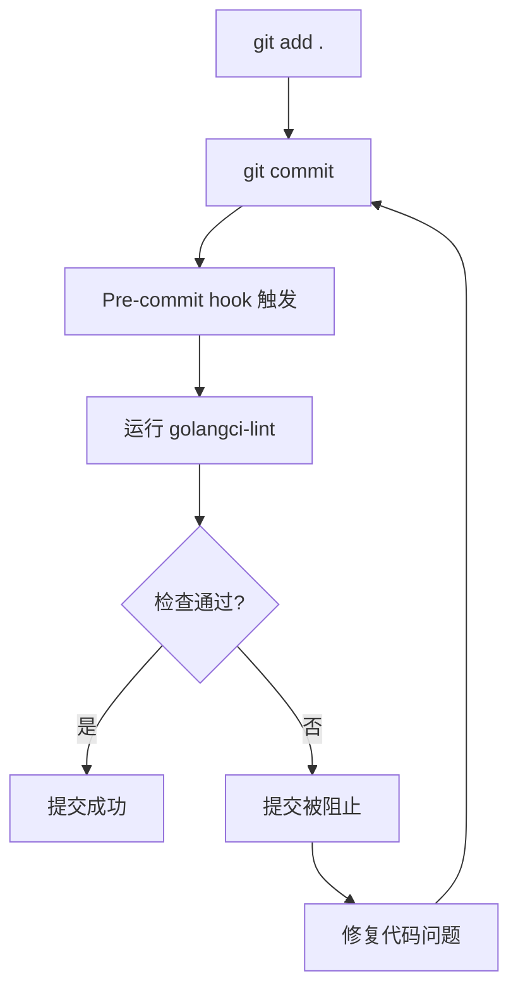

# Git Hooks 系统技术文档

## 概述

本文档详细描述了项目中实现的版本控制 Git Hooks 系统，该系统确保所有团队成员在提交代码前都进行一致的代码质量检查。

## 系统架构

### 目录结构
```
backend/
├── git-hooks/                    # 版本控制的 hooks 源文件
│   ├── pre-commit               # pre-commit hook 实现文件
│   └── README.md               # hooks 使用说明
├── scripts/
│   └── install-hooks.sh        # hooks 自动安装脚本
├── Makefile                    # 包含 install-hooks 目标
├── CONTRIBUTING.md             # 团队贡献指南
└── .golangci.yml               # golangci-lint 配置文件
```

### 核心组件

#### 1. Git Hooks 源文件 (`git-hooks/pre-commit`)

**位置**: `git-hooks/pre-commit`

**功能**:
- 在每次 `git commit` 前自动运行 golangci-lint
- 智能检测项目目录结构
- 提供清晰的成功/失败反馈

**关键实现**:
```bash
# 智能路径检测逻辑
if [ ! -f "go.mod" ]; then
    if [ -f "backend/go.mod" ]; then
        cd backend
    else
        echo "Warning: Could not find go.mod file."
    fi
fi

# 运行 golangci-lint 检查
if golangci-lint run; then
    echo "golangci-lint passed!"
    exit 0
else
    echo "golangci-lint failed!"
    exit 1
fi
```

#### 2. 安装脚本 (`scripts/install-hooks.sh`)

**位置**: `scripts/install-hooks.sh`

**核心变量**:
- `SCRIPT_DIR`: 脚本所在目录
- `PROJECT_ROOT`: 项目根目录 (`$(cd "$SCRIPT_DIR/.." && pwd)`)
- `HOOKS_DIR`: hooks 源目录 (`$PROJECT_ROOT/git-hooks`)
- `GIT_HOOKS_DIR`: Git hooks 目标目录 (`$(git rev-parse --git-dir)/hooks`)

**安装流程**:
1. 自动检测项目结构
2. 创建 `.git/hooks` 目录（如不存在）
3. 复制版本控制的 hooks 到 Git hooks 目录
4. 设置执行权限
5. 提供安装状态反馈

**文件过滤逻辑**:
```bash
# 只复制实际的 hook 文件，跳过文档文件
for hook in "$HOOKS_DIR"/*; do
    if [ -f "$hook" ] && [ "$(basename "$hook")" != "README.md" ] && [[ ! "$(basename "$hook")" =~ \.md$ ]]; then
        # 安装逻辑
    fi
done
```

#### 3. Makefile 集成

**位置**: `Makefile`

**新增目标**:
```makefile
.PHONY: install-hooks
install-hooks: ## Install git hooks
	@echo "Installing git hooks..."
	@./scripts/install-hooks.sh
```

## 安装和使用流程

### 新环境初始化

1. **克隆项目**
   ```bash
   git clone <repository-url>
   cd blog-project/backend
   ```

2. **安装依赖**
   ```bash
   go mod download
   ```

3. **安装 Git Hooks**
   ```bash
   make install-hooks
   ```

### 安装脚本执行细节

**环境检测**:
- 自动检测 Git 仓库位置 (`git rev-parse --git-dir`)
- 验证 hooks 源目录存在性
- 创建必要的目录结构

**文件操作**:
- 复制 hooks 源文件到 Git hooks 目录
- 设置正确的执行权限 (`chmod +x`)
- 跳过非 hook 文件（如 README.md）

**状态报告**:
```
Installing git hooks...
Project root: /path/to/backend
Hooks source: /path/to/backend/git-hooks
Git hooks target: /path/to/.git/hooks
Installing pre-commit...
✓ pre-commit installed

Git hooks installation completed!
```

## GolangCI-Lint 配置

### 配置文件位置
- 主配置: `.golangci.yml`
- 参考配置: `.golangci.reference.yml`

### 当前启用的 Linters
- `errcheck` - 检查未处理的错误
- `govet` - Go 静态分析
- `ineffassign` - 检查无效赋值
- `staticcheck` - 静态检查
- `unused` - 未使用代码检测
- 以及其他扩展规则

### 运行配置
```yaml
run:
  timeout: 2m
  modules-download-mode: readonly
  build-tags:
    - integration
  tests: false
```

## 工作流程

### 正常提交流程


### 错误处理流程

当 golangci-lint 检查失败时：
1. Hook 返回退出码 1
2. Git commit 操作被阻止
3. 显示详细的错误信息
4. 提供手动修复建议

**错误信息示例**:
```
Running golangci-lint...
level=error msg="typechecking error: pattern ./...: directory prefix . does not contain main module"
golangci-lint failed! Please fix the issues before committing.

To run golangci-lint manually: golangci-lint run
To fix issues automatically: golangci-lint run --fix
```

## 高级用法

### 手动运行检查
```bash
# 基本检查
golangci-lint run

# 自动修复
golangci-lint run --fix

# 详细输出
golangci-lint run -v

# 指定文件
golangci-lint run path/to/file.go
```

### 临时跳过 Hooks
```bash
git commit --no-verify -m "commit message"
```

### 更新 Hooks
```bash
# 拉取最新代码
git pull

# 重新安装 hooks
make install-hooks
```

## 故障排除

### 常见问题

#### 1. Hook 脚本权限问题
**症状**: `permission denied: ./scripts/install-hooks.sh`
**解决**:
```bash
chmod +x scripts/install-hooks.sh
```

#### 2. Git hooks 目录不存在
**症状**: `fatal: not a git repository`
**解决**: 确保在 Git 仓库中运行命令

#### 3. GolangCI-Lint 路径问题
**症状**: `typechecking error: directory prefix . does not contain main module`
**解决**:
- 确保在包含 `go.mod` 文件的目录中运行
- 检查 `.golangci.yml` 配置

#### 4. 安装脚本找不到 hooks
**症状**: `git-hooks directory not found`
**解决**:
```bash
pwd  # 确认当前目录
ls git-hooks/  # 确认目录存在
```

### 调试方法

#### 启用详细输出
```bash
# 在 install-hooks.sh 中添加调试信息
set -x  # 启用详细输出
set +x  # 禁用详细输出
```

#### 手动验证 Hook
```bash
# 直接运行 hook 脚本
./git-hooks/pre-commit

# 检查安装的 hook
ls -la .git/hooks/pre-commit
```

## 扩展和定制

### 添加新的 Hook 类型

1. **创建新 hook 文件**
   ```bash
   # 在 git-hooks/ 目录下创建
   touch git-hooks/pre-push
   chmod +x git-hooks/pre-push
   ```

2. **更新安装脚本**
   安装脚本会自动检测并安装新的 hooks。

3. **测试新 hook**
   ```bash
   make install-hooks
   # 触发相应的 Git 操作测试 hook
   ```

### 集成其他工具

可以考虑集成的其他代码质量工具：
- 单元测试覆盖率检查
- 安全漏洞扫描
- 依赖许可证检查
- 代码复杂度分析

## 最佳实践

### 团队协作
1. **统一环境**: 所有团队成员必须运行 `make install-hooks`
2. **定期更新**: 当 hooks 配置更新时，重新安装
3. **文档维护**: 保持相关文档的更新

### 性能优化
1. **增量检查**: 只检查变更的文件（未来改进方向）
2. **并行执行**: 并行运行多个检查工具
3. **缓存机制**: 缓存检查结果避免重复计算

### 监控和报告
1. **失败统计**: 跟踪 hook 失败率
2. **修复时间**: 监控问题修复时间
3. **团队培训**: 定期培训团队成员

## 总结

版本控制的 Git Hooks 系统为项目提供了：
- **一致的代码质量标准**
- **自动化的质量检查流程**
- **简化的团队协作**
- **易于维护和扩展的架构**

通过这套系统，团队能够确保所有提交的代码都符合预定义的质量标准，减少代码审查负担，提高整体代码质量。