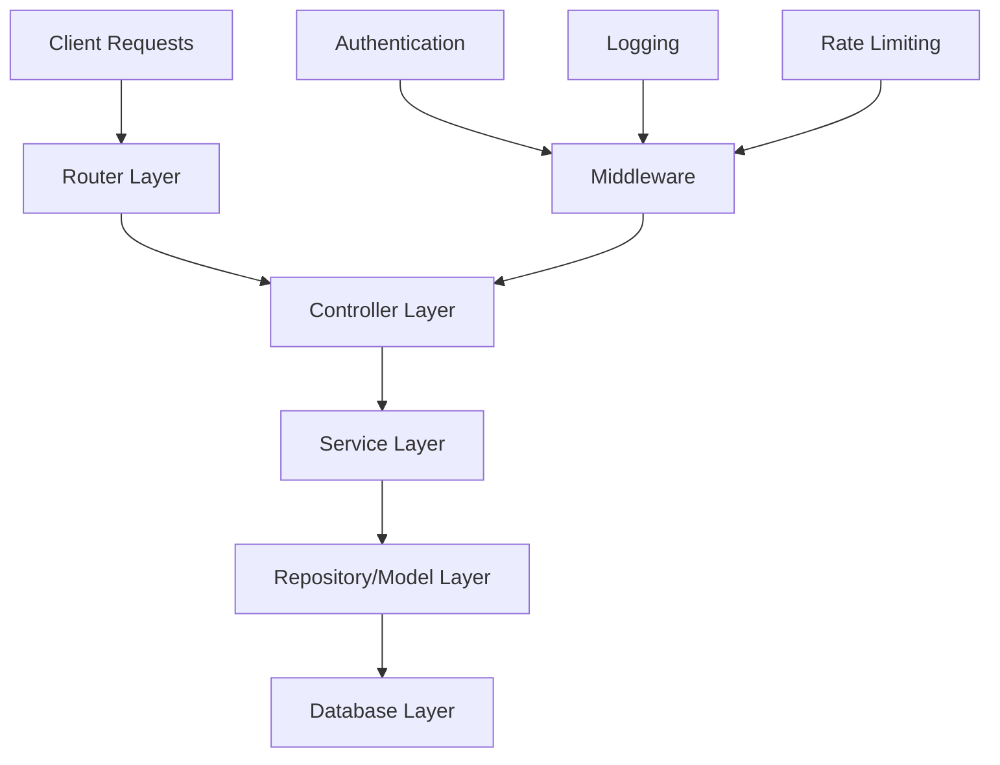
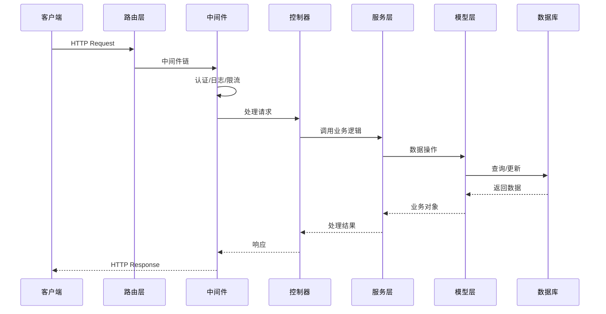

# 项目架构和开发环境文档

## 项目概述

DreamZero Blog Backend 是一个基于 Go 语言的博客后端系统，采用现代化的开发架构和最佳实践。

## 技术栈

### 核心框架
- **Go 1.21+** - 主要编程语言
- **Gin** - HTTP Web 框架
- **GORM** - ORM 数据库操作库
- **Swagger** - API 文档生成

### 数据库和存储
- **MySQL/PostgreSQL** - 主数据库
- **Redis** - 缓存和会话存储
- **MinIO** - 对象存储（文件上传）

### 消息队列和通信
- **Kafka** - 消息队列（邮件发送等）

### 认证和安全
- **JWT** - 身份认证
- **RSA** - 加密解密
- **Rate Limiting** - API 限流

## 项目结构

```
backend/
├── main.go                          # 应用入口点
├── go.mod                          # Go 模块定义
├── go.sum                          # 依赖锁定文件
├── Makefile                        # 构建和任务自动化
├── .golangci.yml                   # 代码质量配置
├── config/                         # 配置文件
│   ├── app.yaml                   # 应用配置
│   ├── database.yaml              # 数据库配置
│   └── redis.yaml                 # Redis 配置
├── controller/                     # 控制器层
│   ├── base.go                    # 基础控制器
│   └── api/
│       └── v1/
│           ├── article.go         # 文章控制器
│           ├── user.go            # 用户控制器
│           ├── photo.go           # 照片控制器
│           ├── daily_photograph.go
│           └── article_comment.go
├── service/                        # 业务逻辑层
│   ├── article.go                 # 文章服务
│   ├── user.go                    # 用户服务
│   ├── photo.go                   # 照片服务
│   ├── daily_photograph.go
│   ├── article_comment.go
│   ├── auth.go                    # 认证服务
│   └── operation_log.go           # 操作日志服务
├── internal/                       # 内部包
│   ├── config/                    # 配置管理
│   │   └── config.go
│   ├── models/                    # 数据模型
│   │   ├── article.go
│   │   ├── user.go
│   │   ├── daily_photograph.go
│   │   └── models.go
│   ├── middleware/                # 中间件
│   │   ├── jwt_interceptor.go     # JWT 拦截器
│   │   ├── cors.go               # CORS 中间件
│   │   ├── rate_limit_middleware.go
│   │   └── middleware.go
│   ├── logger/                    # 日志系统
│   │   ├── logger.go
│   │   └── zapLogger.go
│   ├── oss/                       # 对象存储
│   │   ├── oss.go
│   │   └── minio.go
│   ├── redis/                     # Redis 客户端
│   │   └── redis.go
│   ├── mq/                        # 消息队列
│   │   ├── mq.go
│   │   └── kafka.go
│   ├── email/                     # 邮件服务
│   │   ├── email.go
│   │   └── consumer.go
│   ├── utils/                     # 工具函数
│   │   ├── jwt.go
│   │   ├── bycrypt.go
│   │   ├── util.go
│   │   └── caller.go
│   ├── rsa/                       # RSA 加密
│   │   ├── rsa.go
│   │   └── init.go
│   ├── server/                    # 服务器配置
│   │   └── server.go
│   ├── version/                   # 版本信息
│   │   └── version.go
│   ├── code/                      # 响应码
│   │   └── code.go
│   └── response.go                # 响应格式
├── router/                        # 路由配置
│   ├── router.go                  # 主路由
│   └── api/
│       └── api.go                 # API 路由
├── docs/                          # 文档
│   ├── docs.go                    # Swagger 文档
│   └── development/               # 开发文档
│       ├── git-hooks-system.md
│       ├── install-hooks-guide.md
│       ├── project-architecture.md
│       ├── api-documentation.md
│       ├── deployment-guide.md
│       └── troubleshooting.md
├── scripts/                       # 脚本文件
│   └── install-hooks.sh           # Git hooks 安装脚本
├── git-hooks/                     # Git hooks 源文件
│   ├── pre-commit                # 提交前检查
│   └── README.md                 # Hooks 说明
├── docker/                        # Docker 配置
│   ├── Dockerfile
│   └── docker-compose.yml
├── public/                        # 静态文件
├── temp/                          # 临时文件
├── uploads/                       # 上传文件
├── logs/                          # 日志文件
└── build/                         # 构建输出
```

## 架构模式

### 分层架构

项目采用经典的分层架构模式：



#### 1. 路由层 (Router Layer)
- **位置**: `router/`
- **职责**:
  - URL 路由映射
  - 中间件注册
  - API 版本管理
- **文件**: `router/router.go`, `router/api/api.go`

#### 2. 控制器层 (Controller Layer)
- **位置**: `controller/`
- **职责**:
  - 处理 HTTP 请求
  - 参数验证
  - 调用服务层
  - 响应格式化
- **文件**: `controller/api/v1/*.go`

#### 3. 服务层 (Service Layer)
- **位置**: `service/`
- **职责**:
  - 业务逻辑处理
  - 事务管理
  - 外部服务调用
- **文件**: `service/*.go`

#### 4. 模型层 (Model Layer)
- **位置**: `internal/models/`
- **职责**:
  - 数据模型定义
  - 数据验证规则
  - 数据库映射
- **文件**: `internal/models/*.go`

#### 5. 中间件层 (Middleware Layer)
- **位置**: `internal/middleware/`
- **职责**:
  - 身份认证
  - 权限验证
  - 日志记录
  - 限流控制
- **文件**: `internal/middleware/*.go`

## 数据流架构

### 请求处理流程



### 依赖注入

项目使用依赖注入模式管理组件：

```go
// 服务示例
type ArticleService struct {
    db    *gorm.DB
    redis *redis.Client
    oss   *oss.Client
}

// 控制器示例
type ArticleController struct {
    service *service.ArticleService
}
```

## 开发环境配置

### 环境要求

- **Go**: 1.21 或更高版本
- **Git**: 2.0 或更高版本
- **Docker**: 20.0 或更高版本（可选）
- **MySQL**: 8.0 或更高版本
- **Redis**: 6.0 或更高版本

### 快速开始

#### 1. 克隆项目
```bash
git clone <repository-url>
cd blog-project/backend
```

#### 2. 环境配置
```bash
# 安装 Go 依赖
go mod download

# 复制配置文件模板
cp config/app.yaml.example config/app.yaml
cp config/database.yaml.example config/database.yaml
cp config/redis.yaml.example config/redis.yaml

# 编辑配置文件
vim config/app.yaml
```

#### 3. 安装开发工具
```bash
# 安装 golangci-lint
go install github.com/golangci/golangci-lint/cmd/golangci-lint@latest

# 安装 swag (API 文档)
go install github.com/swaggo/swag/cmd/swag@latest

# 安装 Git hooks
make install-hooks
```

#### 4. 初始化数据库
```bash
# 创建数据库
mysql -u root -p -e "CREATE DATABASE blog_db;"

# 运行数据库迁移（如果有）
go run main.go migrate
```

#### 5. 启动开发服务器
```bash
# 开发模式启动
go run main.go

# 或使用 Makefile
make run

# 生成 API 文档
make docs
```

### 配置文件说明

#### app.yaml
```yaml
app:
  name: "blog-backend"
  version: "1.0.0"
  port: 8080
  env: "development"  # development, production

jwt:
  secret: "your-jwt-secret"
  expire: 24h

upload:
  max_size: 10485760  # 10MB
  allowed_types: ["jpg", "png", "gif"]

email:
  host: "smtp.gmail.com"
  port: 587
  username: "your-email@gmail.com"
  password: "your-app-password"
```

#### database.yaml
```yaml
database:
  driver: "mysql"  # mysql, postgres
  host: "localhost"
  port: 3306
  username: "root"
  password: "password"
  dbname: "blog_db"
  charset: "utf8mb4"
  parse_time: true
  loc: "Local"
  max_idle_conns: 10
  max_open_conns: 100
  conn_max_lifetime: 3600
```

#### redis.yaml
```yaml
redis:
  host: "localhost"
  port: 6379
  password: ""
  db: 0
  pool_size: 10
  min_idle_conns: 5
```

## 开发工具和规范

### 代码质量工具

#### GolangCI-Lint
- **配置文件**: `.golangci.yml`
- **运行命令**: `golangci-lint run`
- **自动修复**: `golangci-lint run --fix`

#### Git Hooks
- **安装**: `make install-hooks`
- **类型**: pre-commit hooks
- **检查**: golangci-lint, tests

#### 测试
```bash
# 运行所有测试
make test

# 运行测试并生成覆盖率报告
go test -coverprofile=cover.out -covermode=atomic ./...
go tool cover -html=cover.out
```

### 代码规范

#### 命名规范
- **包名**: 小写，简短，有意义
- **文件名**: 小写，下划线分隔
- **函数名**: 驼峰命名（Exported）或小写（Private）
- **变量名**: 驼峰命名，简洁明了
- **常量名**: 大写，下划线分隔

#### 注释规范
```go
// Package service provides business logic for the blog application.
package service

// ArticleService handles article-related business operations.
type ArticleService struct {
    db *gorm.DB
}

// CreateArticle creates a new article with the given data.
// It returns the created article ID or an error if creation fails.
func (s *ArticleService) CreateArticle(article *models.Article) (uint, error) {
    // implementation...
}
```

#### 错误处理规范
```go
// 使用自定义错误类型
type ValidationError struct {
    Field   string
    Message string
}

func (e *ValidationError) Error() string {
    return fmt.Sprintf("validation failed for field %s: %s", e.Field, e.Message)
}

// 业务函数中的错误处理
if err != nil {
    return nil, fmt.Errorf("failed to create article: %w", err)
}
```

### API 设计规范

#### RESTful API 设计
```go
// 资源路由设计
GET    /api/v1/articles          // 获取文章列表
GET    /api/v1/articles/:id      // 获取单个文章
POST   /api/v1/articles          // 创建文章
PUT    /api/v1/articles/:id      // 更新文章
DELETE /api/v1/articles/:id      // 删除文章
```

#### 响应格式规范
```go
// 统一响应格式
type Response struct {
    Code    int         `json:"code"`
    Message string      `json:"message"`
    Data    interface{} `json:"data,omitempty"`
    Error   string      `json:"error,omitempty"`
}

// 成功响应
return &Response{
    Code:    200,
    Message: "success",
    Data:    articles,
}

// 错误响应
return &Response{
    Code:    500,
    Message: "internal server error",
    Error:   err.Error(),
}
```

## 构建和部署

### 本地构建
```bash
# 开发构建
make build

# 生产构建
make build-prod

# 交叉编译
GOOS=linux GOARCH=amd64 make build
```

### Docker 构建
```bash
# 构建 Docker 镜像
docker build -t blog-backend .

# 运行容器
docker run -p 8080:8080 blog-backend
```

### 部署配置

#### Docker Compose
```yaml
version: '3.8'
services:
  app:
    build: .
    ports:
      - "8080:8080"
    depends_on:
      - db
      - redis
    environment:
      - GIN_MODE=release

  db:
    image: mysql:8.0
    environment:
      MYSQL_ROOT_PASSWORD: password
      MYSQL_DATABASE: blog_db

  redis:
    image: redis:6.2-alpine
```

## 性能优化

### 数据库优化
- 使用索引优化查询性能
- 连接池配置优化
- 查询缓存策略

### 缓存策略
- Redis 缓存热点数据
- 本地缓存配置
- 缓存失效策略

### 并发处理
- Goroutine 池管理
- Channel 通信
- 锁机制优化

## 安全考虑

### 身份认证
- JWT Token 认证
- Token 刷新机制
- 密码加密存储

### 数据安全
- SQL 注入防护
- XSS 攻击防护
- CSRF 防护

### API 安全
- 请求限流
- 参数验证
- 敏感数据脱敏

## 监控和日志

### 日志系统
- 结构化日志
- 日志级别管理
- 日志轮转

### 性能监控
- 响应时间监控
- 错误率统计
- 系统资源监控

这个架构文档为开发团队提供了完整的技术参考，确保项目能够按照最佳实践进行开发和维护。